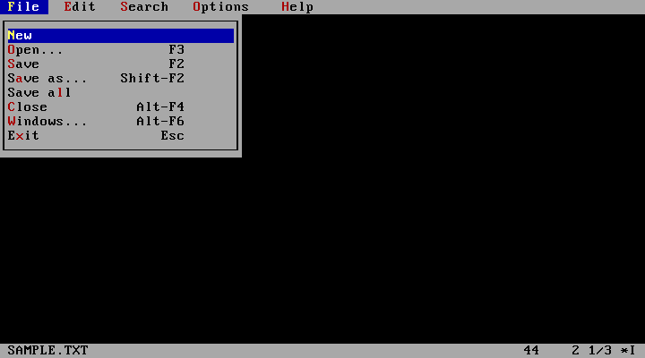

# Classic menu interface

The editor has File, Edit, Search, Options and Help menus on the top row.
Document name, dirty state and cursor information occupy the bottom row;
the viewport reserves both rows. F10 opens File. Alt-F/E/S/O/H opens a group
directly. Arrows navigate groups and entries, Home/End select the first/last
entry, Enter executes and Esc or F10 cancels. Highlighted letters are menu
mnemonics. Mouse clicks and pointer selection are implemented but still need
qualification with a DOS mouse driver.

`DWEDCMD.PAS` defines logical commands. `DWEDHNDL.PAS` dispatches both menu
choices and mapped shortcuts through `execute_command`; menu code does not
enqueue simulated keystrokes. Navigation remains in the existing event table.
The dispatcher adapts command options to the legacy callbacks and restores
the menu bar after their temporary input prompts. Its near declarations must
match the implementations; editor callback procedures remain far.

Opening and cancelling a menu preserves text selection. Cut and Copy are
disabled without selection, and Paste is disabled when no clipboard source is
available. New creates an unnamed document; its Save command asks for a name.
Find/Replace currently uses the inherited combined input flow. The menu
structure is present, but this is not completion of the EDIT release gates.

Remaining work includes undo/redo, consistent Save/Discard/Cancel handling
(especially unnamed documents during Exit and Save All), tab-stop display,
clipboard fidelity, mouse qualification, monochrome/accessibility checks and
the remaining command/dialog tests. No inactive Undo command is presented as
working functionality.

The parent QEMU suite checks Save via menu navigation and Alt-F, selection
retention through Copy/Paste and cancellation, and restoration of the menu bar
after cancelling Open through both menu and shortcut paths. Existing save,
text-format, launcher and keyboard regressions run against the same build.
